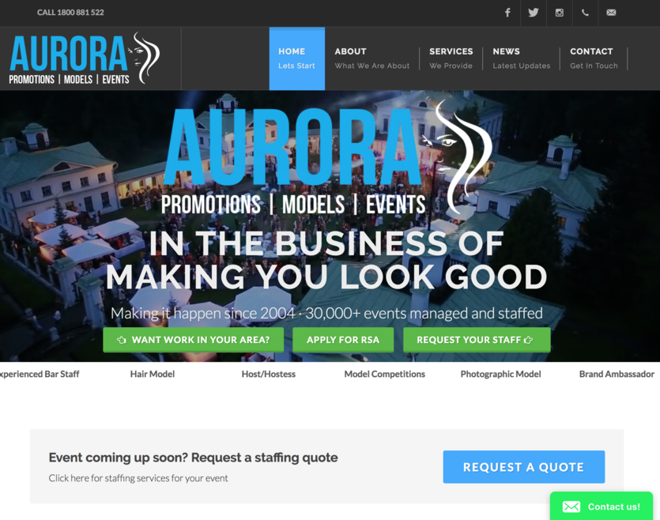

  

Aurora is an event management industry that showcases Australia's models, and as well as host events. My father, whom was a web designer and developer, wanted to give me a "job", so I can gain some experience and utilize some of the skills that I have attained. Afterwards, he showed me how he was able to utilize JavaScript to incorporate fun and interactive parts to the site. 

To begin this project, I first started off with creating the logo. I began sketching out numerous variations that can represent their model management. With this process I had to look at different fonts and color palettes that can suit the logo and the site. I used Adobe Illustrator to create a clean file to show all different choices for the logo. After finishing up the logo, I began looking at different websites to gain inspiration on how I want to go about making the website. From there I drawed it out on paper, and began constructing the basic look of it in HTML, then I began stylizing the site with CSS. I then sent over my work to my dad and from there, my dad changed a few things here and there, and implemented JavaScript to the website.

Here is a link to the website: [Aurora](http://auroraeventmanagement.com.au/index.php).

