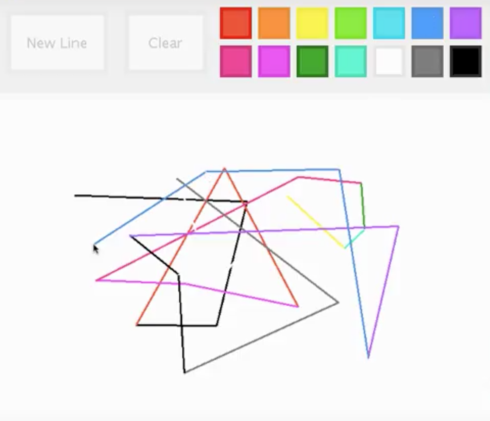

  

Last spring semester, in ICS 111, we were given our first project to construct a paint application. We were tasked to put the skills we have newly attained to develop this project to show our comprehension of EZ Graphics and the code concepts we have been taught. 

For this project, I made sure to first draft out how I wanted the program to look. Afterwards, I began building a general skeleton of the application, then I slowly began adding in complex elements such as response to clicks, and the line . Finally, I spruced up the code to essentially make it look more nicer and appealing.

Here is a link to a YouTube video demonstrating the use of the program: [YouTube](https://www.youtube.com/watch?time_continue=1&v=T1W3dfN8-hg).

