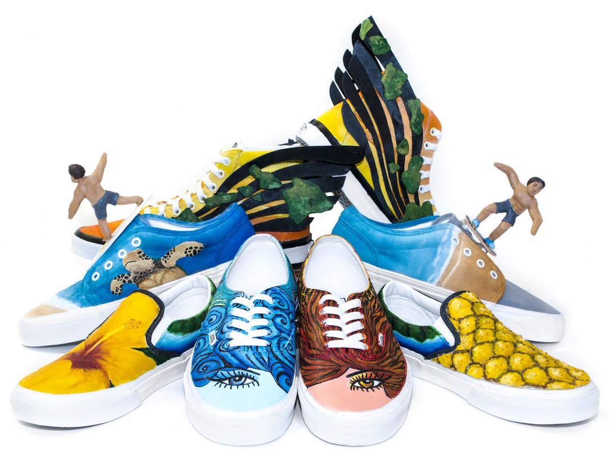

  

Vans Custom Culture is a yearly competition for high school students nationwide to showcase their creativity. Students are challenged to create four different designs all revolving around one main theme. These four categories were sports, art, music, and "local flavor." Each school is provided four different shoe styles from VanS, to create their individual looks right onto the shoes. The judging process involves a narrow down to 50 schools, then a public voting to select the top 5. McKinley High School was the only Hawaii school to make it into the semi-finalist round, and as well as the school with the highest votes.  

For this contest, I was one of the four main designers responsible for creating the look and design for the art category. My process began with making multiple drafts and sketches for the shoe, and communicating these ideas with my group. From here I drafted my design onto the shoe and used acrylic paints to color the shoe. After the process of designing our shoes, we received notification that our shoes made it into the semi-finals round, and we had to attain votes to get our school into the top 5. To attain votes and bring light to this, I created a promotional website that talked about the contest and showcased the shoes. To create the website I had to first draft the look I was wanting to go for, and then from there I began putting in the basic framework of the site and stylize it in the end using CSS. 

Here is a website that gives coverage to the shoe designs: [KHON2 ~ Living808](http://khon2.com/2015/05/04/support-local-students-at-the-vans-custom-culture-contest/).

